

NAMA : NURHALIZA
NIM : 2110131120007
___
### LAYER PADA GAMBAR BERWARNA DAN FUNGSI IMREAD(), IMSHOW(), SERTA IMHIST() PADA SOFTWARE OCTAVE

#### A. LAYER WARNA

Terdapat dua jenis layer warna pada citra 
digital, yaitu Citra rgb dan Citra grayscale.

gambar yang akan kita gunakan adalah gambar dengan dimensi 32x32x3:

    

**1. Citra RGB**
   
   Citra RGB merupakan citra digital yang mengandung matriks data berukuran M × N × 3 yang merepresentasikan warna merah, hijau, dan biru untuk setiap pikselnya. Setiap warna dasar diberi rentang nilai tersendiri. Nilai rentang paling kecil yaitu 0 dan paling besar yaitu 255. Warna dari tiap piksel ditentukan oleh kombinasi dari intensitas merah, hijau, dan biru. Berikut contoh Citra RGB dari sebuah gambar.
* Layer Red
        

            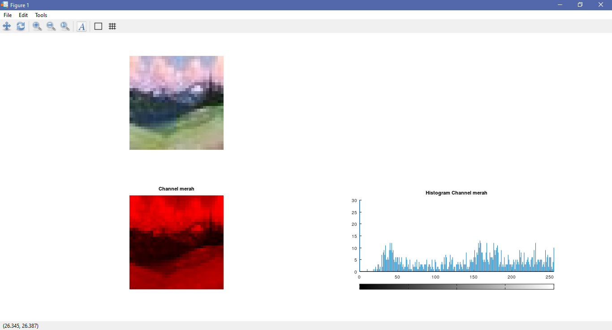
        

* Layer Green       
        

        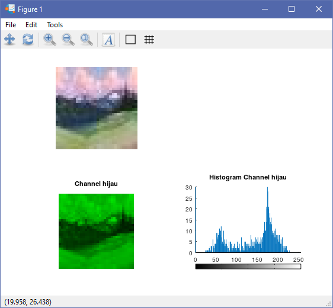
        

* Layer Blue
        

        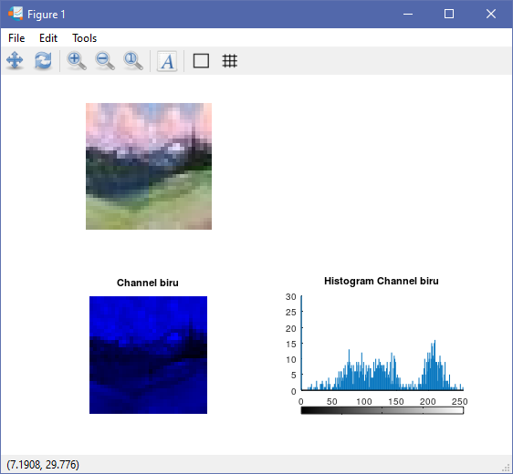
        

**2. Citra Grayscale**
Citra grayscale merupakan citra yang nilai pikselnya merepresentasikan derajat keabuan. Nilai intensitas paling rendah merepresentasikan warna hitam dan nilai intensitas paling tinggi merepresentasikan warna putih. Pada umumnya citra grayscale memiliki kedalaman piksel 8 bit 256 derajat keabuan yang dalam hal ini nilai 0 menyatakan warna hitam, nilai 255 menyatakan warna putih, dan 5 nilai di antara 0 sampai 255 menyatakan warna keabuan yang terletak di antara hitam dan putih. Berikut contoh Citra Grayscale dari sebuah gambar.
* Grayscale
    

    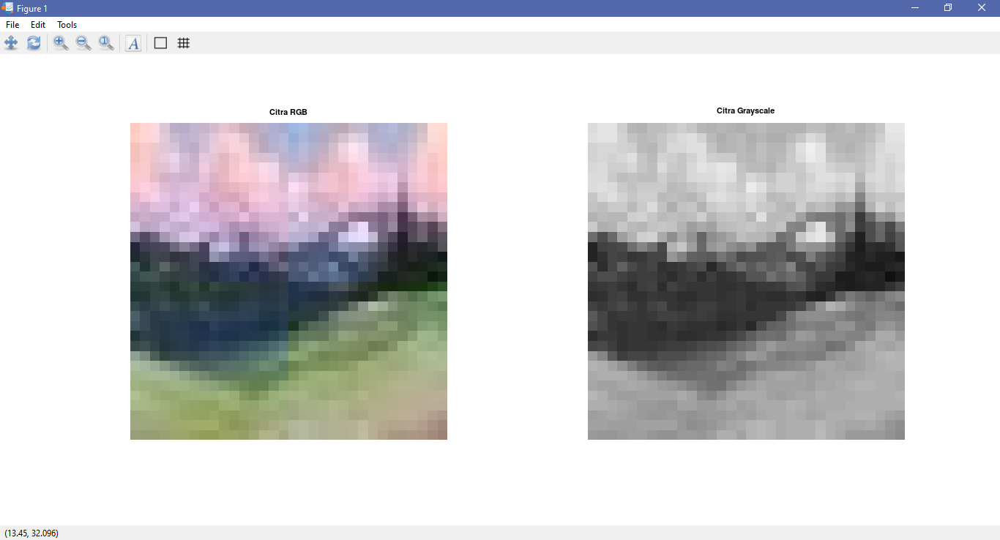
    

#### B. FUNGSI IMREAD(), IMSHOW(), DAN IMHIST()

1. imread()
   imread() adalah sebuah command/perintah yang digunakan untuk membaca file gambar sebagai matriks. Jika file berisi gambar skala abu-abu, gambar adalah array dua dimensi (M-by-N). Jika file berisi gambar berwarna, gambar adalah larik tiga dimensi (M-kali-N-kali-3). Kelas dari array yang dikembalikan tergantung pada tipe data yang digunakan oleh format file.
   * contoh
        

        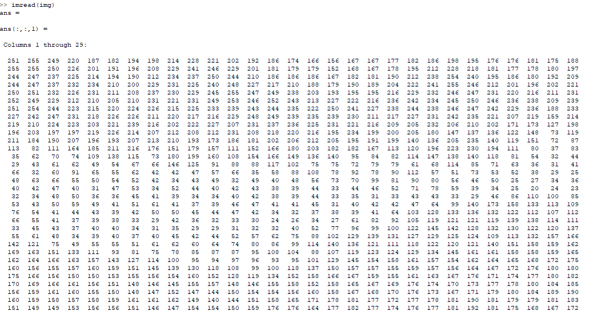
        

        

        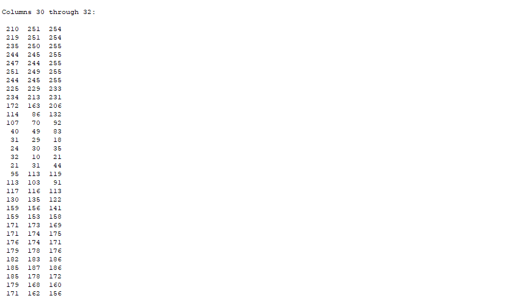
        

        

        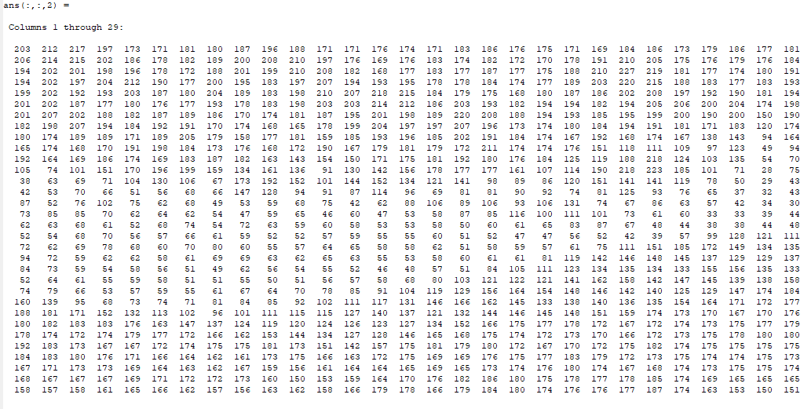
        

        

        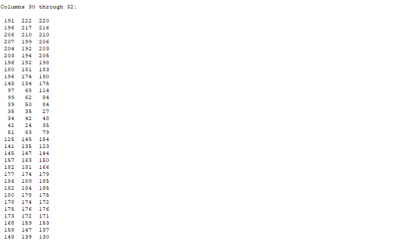
        

        

        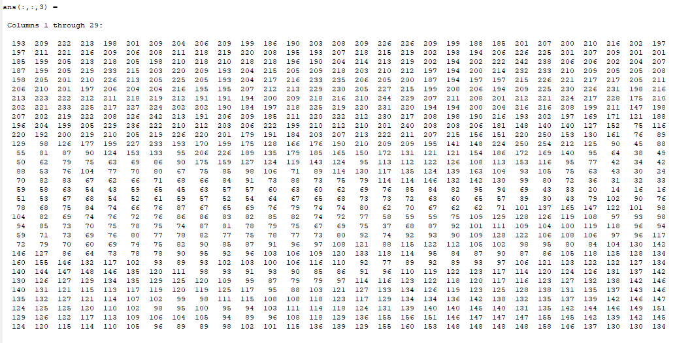
        

        

        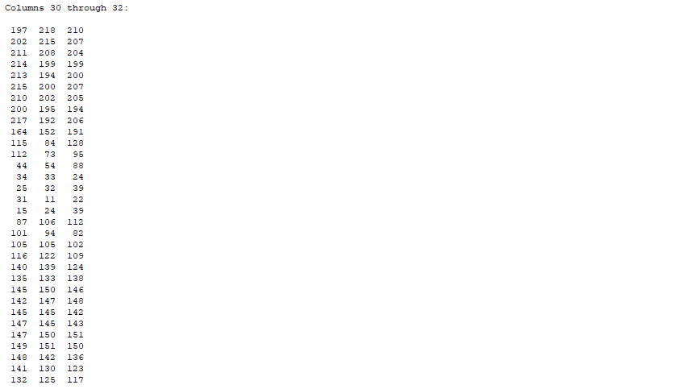
        

2. imshow()
   imshow adalah sebuah command/perintah untuk menampilkan citra asli pada Octave.
   * contoh
        

        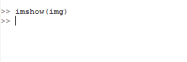
        

        

        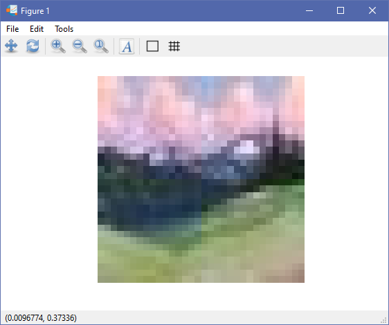
        

3. imhist()
   imhist adalah sebuah command/perintah untuk menampilkan sebuah citra dalam bentuk Histogram.
   * contoh
        

        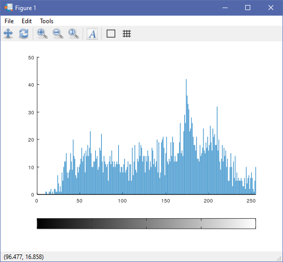
        
