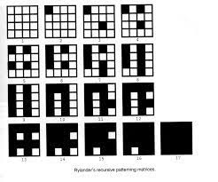
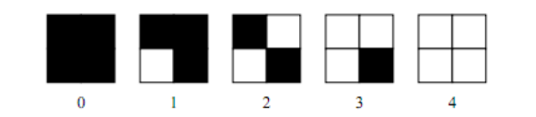
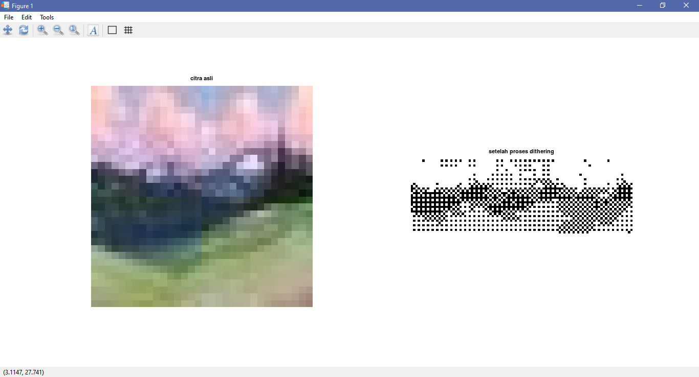

Nama : Nurhaliza

NIM: 2110131120007

Mata Kuliah : Pemrosesan Citra Digital

---

#### DIGITAL HALFTONING : PATTERING DAN DITHERING

Gambar di publikasi surat kabar, majalah dan buku dengan proses pencetakan yang disebut halftoning dan gambar yang direproduksi disebut halftones. Halftoning atau halftoning analog adalah proses yang mensimulasikan nuansa abu-abu dengan memvariasikan ukuran titik-titik hitam kecil yang diatur dalam pola yang teratur.

untuk foto hitam putih, setiap area intensitas direproduksi sebagai rangkaian lingkaran hitam pada latar belakang putih. daerah yang lebih gelap dicetak dengan lingkaran yang lebih besar dan daerah yang lebih terang dicetak dengan lingkaran yang lebih kecil (lebih banyak daerah putih). Gambar didekomposisi menjadi kotak sel halftone. Elemen gambar disimulasikan dengan mengisi sel halftone yang sesuai. Semakin banyak jumlah titik hitam dalam sel halftone, semakin gelap sel tersebut.

Digital Halftoning yang efektif dapat secara substansial meningkatkan kualitas gambar yang diberikan.

Ada dua metode umum yang digunakan untuk menghasilkan Digital Halftoning, yaitu :
1. Patterning
2. Dithering

---

**1. PATTERNING**

Patterning adalah metode paling sederhana dari dua metode untuk menghasilkan gambar halftoning.Patterning melibatkan penggantian setiap pixel dengan pola yang di ambil dari font biner. pixel dengan gray level 0 diganti dengan matrix tanpa pixel putih sedangkan gray level 1 di ganti dengan matrix single white pixel. 

    

Patterning menghasilkan gambar yang memiliki resolusi spasial lebih tinggi daripada gambar asli. Jumlah sel halftone citra keluaran sama dengan jumlah piksel citra sumber. Namun, setiap sel halftone dibagi lagi menjadi kotak 3x3. Setiap nilai piksel input diwakili oleh jumlah kotak terisi yang berbeda dalam sel halftone.

**2. DITHERING**

Karena sistem visual manusia mengambil area sekitar di piksel, Bukan melihat setiap piksel sendiri-sendiri, sehingga memungkinkan untuk membuat ilusi dari beberapa tingkat keabuan di dalam sebuah citra biner yang dalam kenyataanya hanya terdiri dari dua tingkat abu-abu. Dengan menggunakan matriks 2x2 piksel, lima nilai intensitas "efektif" yang berbeda dapat terwakili, seperti yang diilustrasikan pada Gambar. Demikian juga dengan matriks 4x4 piksel, sepuluh buah tingkat kabuan yang berbeda dapat terwakili. Metode ini disebut dengan dithering , dalam proses dithering blok asli pada citra kemudian akan diganti dengan jenis pola biner tersebut.

    

Dithering dilakukan dengan membandingkan setiap blok dari citra asli dengan sebuah matriks pembatas yang disebut dengan matriks dither. Masing-masing elemen dari blok asli dikuantisasi sesuai dengan nilai batas pada pola dither . Nilai-nilai pada matriks dither adalah tetap, tetapi bisa bervariasi sesuai dengan jenis citra.

*Contoh proses Dithering pada software OCTAVE*

        image = imread('photo2.jpg');
        de = [0 128; 192 64];
        matz = size(de);
        [baris,kolom]=size(image);
        g=zeros(baris,kolom);

        for a=1:baris
          for b=1:kolom
            x = mod(a,matz)+1;
            y = mod(b,matz)+1;
            if image(a,b)> de(x,y)
              g(a,b)=1;
            else
              g(a,b)=0;
            endif
          endfor
        endfor

        subplot(1,2,1);imshow(image);title('citra asli');
        subplot(1,2,2);imshow(g);title('setelah proses dithering');

<i>Dithering Result</i>
    

