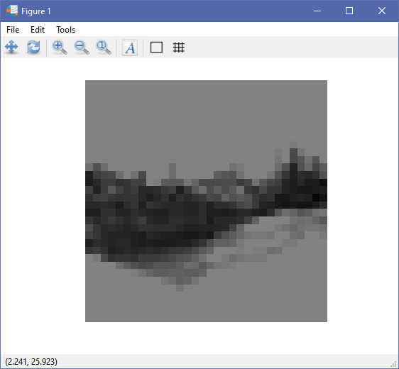
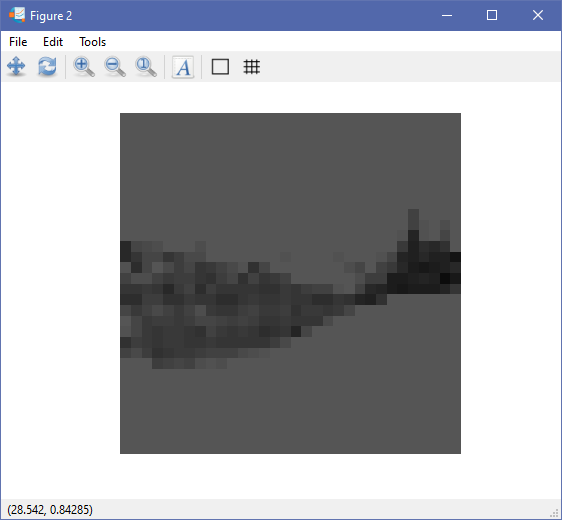
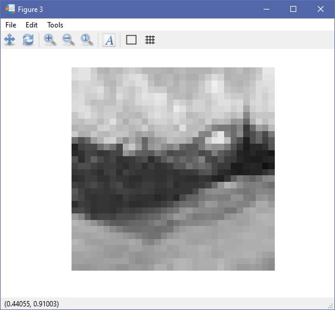

Nama : Nurhaliza

NIM: 2110131120007

Mata Kuliah : Pemrosesan Citra Digital

---

#### COLOR TO GRAYSCALE CONVERSION : LIGHTNESS METHOD, AVERAGE METHOD, LUMINOUSITY METHOD

Ada tiga metode umum yang digunakan untuk mengkonversikan citra berwarna ke citra kelabu.

**1. LIGHTNESS METHOD**

Metode lightness mengambil nilai rata rata value dari sebuah komponen dengan value tertinggi dan terendah

grayscale : min(R,G,B)+max(R,G,B)/2

metode ini memiliki kelemahan karena komponen RGB tidak digunakan. Sedangkan jumlah cahaya yang di tangkap oleh mata tergantung pada tiga warna dasar.

*konversi grayscale pada software octave menggunakan metode lightness*

        img = imread('photo2.jpg');
        R = img(:,:,1);
        G = img(:,:,2);
        B = img(:,:,3);
        lightness = (min(R,G,B)+max(R,G,B))/2;
        imshow(lightness);

    <i>Result of lightness method</i>

**2. AVERAGE METHOD**

Average method mengambil nilai rata rata dari ketiga komponen warna (RGB) sebagai nilai skala kelabu

grayscale = R+G+B/3

metode rata-rata juga memiliki kelemahan karena memberikan perbandingan yang sama untuk setiap komponen warna. Berdasarkan penelitian tentang penglihatan manusia, mata kita bereaksi terhadap setiap warna dengan cara yang berbeda. Secara khusus, mata kita lebih sensitif terhadap hijau, lalu merah, dan akhirnya biru.

*konversi grayscale pada software octave menggunakan metode average*

        img = imread('photo2.jpg');
        R = img(:,:,1);
        G = img(:,:,2);
        B = img(:,:,3);
        average = (R+G+B)/3;
        imshow(average);

    <i>Result of average method</i>

**3. LUMINOUSITY METHOD**

Luminousity method mengacu pada bobot setiap komponen. Kontribusi warna biru pada nilai akhir harus berkurang, dan kontribusi warna hijau harus meningkat.

grayscale = (0.3 x R) + (0.59 x G) + (0.11 x B)

luminousity method menjadi metode terbaik yang berhasil memecahkan permasalahan dari metode - metode sebelumnya.

*konversi grayscale pada software octave menggunakan metode luminousity*

        img = imread('photo2.jpg');
        R = img(:,:,1);
        G = img(:,:,2);
        B = img(:,:,3);
        luminousity = (0.3*R)+(0.59*G)+(0.11*B)
        imshow(luminousity);

    <i>Result of luminousity method</i>

