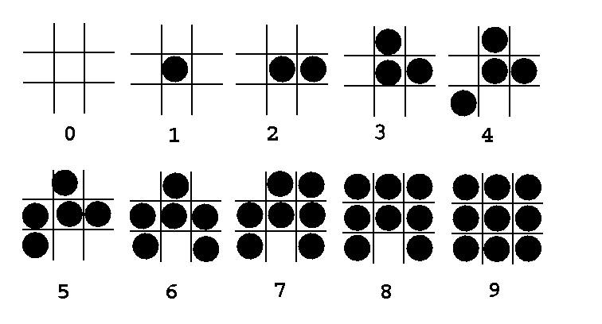
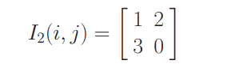
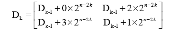
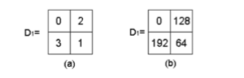
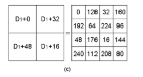

Nama : Nurhaliza

NIM: 2110131120007

Mata Kuliah : Pemrosesan Citra Digital

---

#### MENENTUKAN POLA PATTERNING

Ada beberapa aturan untuk membuat pola patterning, yaitu: 

1. pola harus membentuk urutan pertumbuhan (Growth Sequence)
2. titik dimulai di tengah sel dan tumbuh ke luar
3. titik baru yang akan dicetak untuk tingkat intensitas tertentu harus berdekatan dengan sel dengan titik yang dicetak
4. Hindari pola simetris. pola simetris akan menghasilkan coretan vertikal, horizontal, atau diagonal (garis tipis yang berbeda dari sekelilingnya) dalam jumlah besar yang diarsir dengan tingkat intensitas.
5. pola kisi dengan satu piksel "aktif" atau satu dengan piksel "aktif" yang terisolasi harus dihindari.
   
contoh pola patterning 3x3 dengan aturan:

    

selain itu, ada beberapa bentuk umum untuk menentukan growth sequence dari pola tersebut, yaitu menggunakan cluster of pixel atau a mask of pixel position. contoh untuk pola 2x2:

    

#### MENENTUKAN MATRIKS DITHER ATAU MATRIKS TRESHOLD

Rumus untuk menentukan matriks dither atau matriks treshold:

Treshold 2x2

    

Untuk k=1, di dapat hasil

    

Selanjutnya, untuk menemukan dither matriks dengan ukuran 4x4 maka kita hraus menambahkan matriks di setiap bagian yang sama untuk 2x2 dengan rumus:

    

maka di dapat hasil yang ada di ruas kanan.

#### PERBANDINGAN MATRIKS DITHER 2X2 DAN 4X4

Matriks dither dengan ukuran 4x4 atau dengan ukuran besar akan memberikan kualitas yang lebih baik dari pada matriks yang lebih kecil di bawahnya seperti matriks dither 2x2. Itu di karenakan matriks dither dipasang di seluruh gambar. Semakin besar matriksnya, maka akan semakin baik tampilannya.