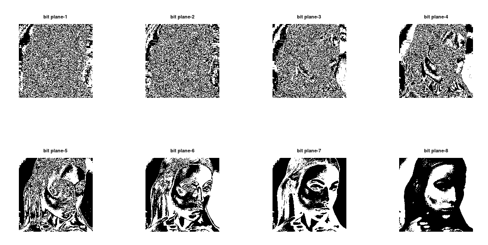
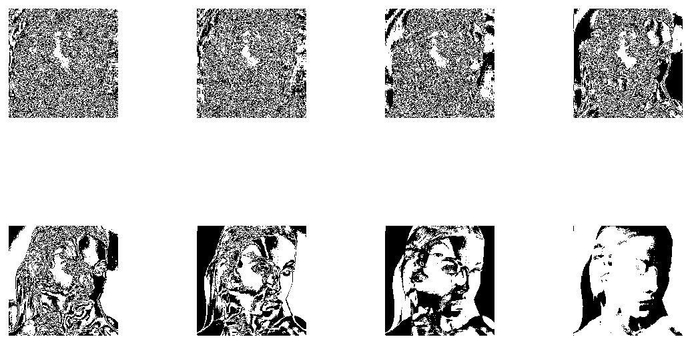
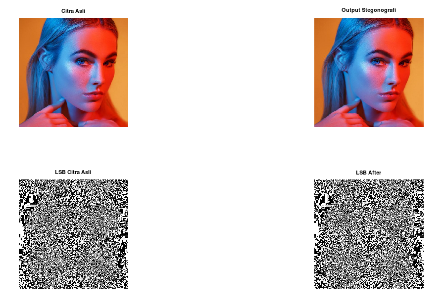
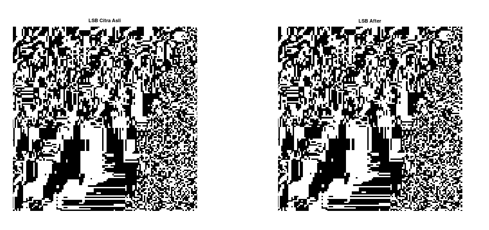

Nama : Nurhaliza

NIM: 2110131120007

Mata Kuliah : Pemrosesan Citra Digital

---

####TUGAS 5 DAN 6

### BIT PLANE SLICING DAN STEGONOGRAPHY

Bit Plane Slicing adalah sebuah metode untuk melihat kontribusi atau pengaruh dari tiap tiap bit penyusun citra. Salah satu aspek penggunaan Bit Plane Slicing adalah kita dapat menentukan apakah bidang bit merupakan noise tidak beraturan atau berisikan suatu informasi penting.

### 1. BIT PLANE SLICING SEBUAH CITRA

kita akan bereksperimen dengan sebuah citra berukuran 512 x 512:

    

kita akan menampilkan setiap bidang bit dengan software octave:

        %laod citra
        img = imread("girlPotrait.jpg");

        %mengambil nilai setiap channel warna
        R = img(:,:,1);
        G = img(:,:,2);
        B = img(:,:,3);

        %mengubah citra warna menjadi citra kelabu
        imgGray = (0.3 * R) + (0.59 * G) + (0.11 * B);

        %menampilkan setiap bidang bit dengan bitget
        figure(1);
        for i = 1:8
        bitImg = bitget(imgGray,i);
        subplot(2,4,i);imshow(bitImg);
        endfor

output dari code tersebut adalah:

    

### 2. BIT PLANE SLICING GABUNGAN DUA BUAH CITRA

Selanjutnya kita akan menggabungkan sebuah citra baru dengan citra sebelumnya berdimensi 512 x 512:

    

dengan menggunakan method imadd, kita dapat menggabungkan dua buah citra. berikut code untuk bit plane slicimg dan imadd:

        %laod citra
        img1 = imread("girlPotrait.jpg");
        img2 = imread("girlPotraitColor.jpg");

        %menggabungkan dua buah citra
        b = imadd(img2,img1);

        %mengambil nilai setiap channel warna
        R = b(:,:,1);
        G = b(:,:,2);
        B = b(:,:,3);

        %mengubah citra warna menjadi citra kelabu
        imgGray = (0.3 * R) + (0.59 * G) + (0.11 * B);

        %menampilkan setiap bidang bit dengan bitget
        figure(1);
        for i = 1:8
        bitImg = bitget(imgGray,i);
        subplot(2,4,i);imshow(bitImg);
        endfor

output dari kode tersebut adalah:

    

### 3. STEGONOGRAPHY

Kita akan menyelipkan sebuah kalimat ke dalam Citra dengan menggunakan algoritma stegonography. Citra yang akan kita gunakan:

    

        %load citra kemudian di simpan dalam variabel img
        img = imread("girlPotrait.jpg");

        %menyimpan ukuran gambar
        [row, col] = size(img);

        %mengalikan panjang string dengan 8
        stg = "Nurhaliza 2110131120007";
        Length_m = length(stg) * 8;

        %mendapatkan nilai ASCII dari setiap huruf dalam pesan
        %mengubah bentuk desimal ke binary dan mengambil masing masing baris
        ascii_m = uint8(stg);
        binary_m = dec2bin(ascii_m, 8);
        binary_m = transpose(binary_m);
        binary_m = binary_m(:);
        binary_m = str2num(binary_m);

        result = img;

        %iterasi
        x = 1;

        for i = 1:8
        for j = 1:row
            for k = col
            if (x <= Length_m)
                LSB = bitget(img(j,k),i);
                bin_m = binary_m(x);
                temp = xor(LSB,bin_m);
                result(j,k) = img(j,k) + temp;
                x++;
            else
                break;
            endif
            endfor
        endfor
        end

        %menyimpan citra output stegonografi
        imwrite(result, 'stegonografi.png');

        imgGray = rgb2gray(img);
        resultgGray = rgb2gray(result);
        lsb_before = bitget(imgGray,1);
        lsb_result = bitget(resultgGray,1);

        subplot(2,2,1);imshow(img);title('Citra Asli');
        subplot(2,2,2);imshow(result);title('Output Stegonografi');
        subplot(2,2,3);imshow(lsb_before);
        subplot(2,2,4);imshow(lsb_result);

maka output yang di dapat adalah:

    

kita akan melihat perbedaan nya pada salah satu bidang bit, yaitu bidang bit LSB:

    

terlihat bahwa pada baris pertama citra terdapat beberapa perbedaan warna hitam yang menjadi putih maupun sebaliknya.
