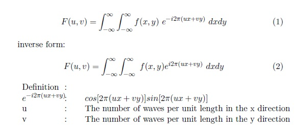

Nama : Nurhaliza

NIM: 2110131120007

Mata Kuliah : Pemrosesan Citra Digital

---

### IMAGE ENHACEMENT : SPASIAL DOMAIN DAN FREKUENSI DOMAIN

Image Enhacement adalah proses agar citra menjadi lebih baik secara visual untuk penerapan tertentu. Image Enhacement mengacu pada proses menyoroti informasi tertentu dari suatu gambar, serta melemahkan atau menghapus informasi yang tidak perlu sesuai dengan kebutuhan khusus. Misalnya, menghilangkan noise, mengungkapkan detail buram, dan menyesuaikan level untuk menyorot fitur gambar.

Teknik Image Enhacement dapat dibagi menjadi dua kategori besar, yaitu:

1. SPASIAL DOMAIN

peningkatan ruang citra yang membagi citra menjadi piksel-piksel yang seragam sesuai dengan koordinat spasial dengan resolusi tertentu. Metode domain spasial melakukan operasi pada piksel secara langsung. misalkan:

f(x,y) : citra input

g(x,y) : citra output

T : operator terhadap f

metode pemrosesan citra dalam ranah spasial dinyatakan sebagai:

g(x,y) = T[f(x,y)]

T bisa beroperasi pada satu pixel, sekelompok pixel bertetangga, atau keseluruhan pixel dalam citra. Jadi, metode dalam ranah spasial dapat di lakukan pada aras titik (pixel), aras lokal dan aras global.

2. FREKEUNSI DOMAIN

peningkatan yang diperoleh dengan menerapkan Transformasi Fourier ke domain spasial. Dalam domain frekuensi, piksel dioperasikan dalam kelompok maupun secara tidak langsung.

Transformasi Fourier digunakan dalam domain frekuensi untuk penyaringan. Transformasi Fourier diperkenalkan oleh matematikawan Perancis Jean Baptiste Joseph Fourier. Karyanya diterbitkan pada tahun 1822 dalam bukunya, La Theorie Analitique de la Chaleur. Gagasan utama di balik konsep ini adalah sinyal apa pun dapat dipecah menjadi kombinasi gelombang sederhana. Secara rinci, setiap fungsi periodik dapat digambarkan sebagai penjumlahan dari sinus dan/atau cosinus dari frekuensi yang berbeda. Berikut adalah notasi untuk 2d dalam transformasi fourier,

    

Dengan mengubah domain spasial menjadi domain frekuensi, beberapa filter yang mungkin dapat digunakan seperti low pass, high pass, band pass dan band stop filter.